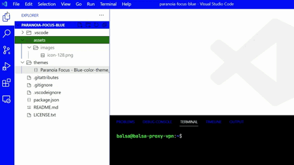

# Classic Essential Colors (Blue)

> [Visual Studio Code](https://marketplace.visualstudio.com/) `>` [Themes](https://marketplace.visualstudio.com/search?target=VSCode&category=Themes&sortBy=Installs) `>` [Classic Essential Colors (Blue)](https://marketplace.visualstudio.com/items?itemName=balsa.vscode-theme-classic-essential-colors-blue)

```
Let's make coding mood like in the 90s.
Designed using limited colors. (Maybe) Helps focus on coding.
```



## Author

- Taegyun Ko <dev@balsa.to>

## Updated

  - 2023-02-12

    Bugfix: Unseeing syntax color updated.

  - 2023-02-27

    Bugfix: Unseeing panel icon updated.

## License

NO LICENSE